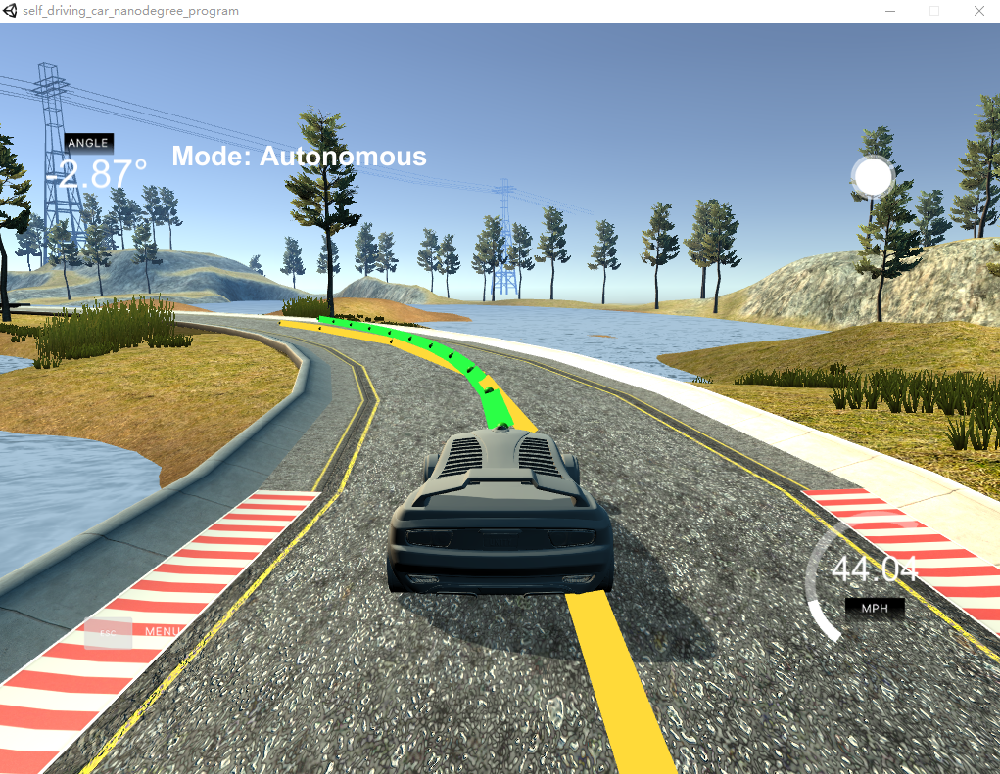

# CarND-Controls-MPC
Udacity Self-Driving Car Engineer Nanodegree Program, Term 2 ,Project 5 - Controls MPC

## Project Basics
This project is write by C++.

I used a nonlinear model predictive controller (NMPC) to steer a car around a track in a simulator.

This project involves the Term 2 Simulator.

## The Vehicle Model

*Student describes their model in detail. This includes the state, actuators and update equations.*

The kinematic bicycle model used consists of the following equations which can be found in the class FG_eval:
```
       x[t+1] = x[t] + v[t] * cos(psi[t]) * dt
       y[t+1] = y[t] + v[t] * sin(psi[t]) * dt
       psi_[t+1] = psi[t] + v[t] / Lf * delta[t] * dt
       v[t+1] = v[t] + a[t] * dt
       cte[t+1] = f(x[t]) - y[t] + v[t] * sin(epsi[t]) * dt
       epsi[t+1] = psi[t] - psides[t] + v[t] * delta[t] / Lf * dt
```

x,y:the vehicle's x and y coordinates  
psi:orientation angle  
v: velocity  
cte:the cross-track error
epsi:the orientation error  
Lf:the distance between the center of mass of the vehicle and the front wheels and affects the maneuverability. It set to 70.

*Student discusses the reasoning behind the chosen N (timestep length) and dt (elapsed duration between timesteps) values. Additionally the student details the previous values tried.*

N:the number of timesteps in the horizon which set to 12  
dt:the time elapse of each timestep which set to 0.1.

The number N also determines the number of variables optmized by the controller. So, higher N will result in extra computational cost.The first time I set N is 25 which resulted in a complete crash.The I found which set 12 can get a good result and 10 is also ok.

dt smaller than 0.1 did not work.First set to 0.05, the car crashed.dt should be in sync with the latency,which is 0.1s in this system.

*A polynomial is fitted to waypoints. If the student preprocesses waypoints, the vehicle state, and/or actuators prior to the MPC procedure it is described.*

I transformed the waypoints to vehicle's perspective:
```
 vector<double> xset;
		  vector<double> yset;

		  for (int i = 0; i < ptsx.size(); i++) {
			  double dx = ptsx[i] - px;
			  double dy = ptsy[i] - py;
			  xset.push_back(dx * cos(-psi) - dy * sin(-psi));
			  yset.push_back(dx * sin(-psi) + dy * cos(-psi));
		  }
```

*The student implements Model Predictive Control that handles a 100 millisecond latency. Student provides details on how they deal with latency.*

First, in the cost functions, I put CTE,epsi,velocity difference,delte and I also combined velocity and delta cost. And I tuned the parameters to get a smoother result.
```
for (int i = 0; i < N; i++) {
      fg[0] += 500*CppAD::pow(vars[cte_start + i], 2);
      fg[0] += 500*CppAD::pow(vars[epsi_start + i], 2);
      fg[0] += CppAD::pow(vars[v_start + i] - ref_v, 2);
    }

    for (int i = 0; i < N - 1; i++) {
      fg[0] += 5*CppAD::pow(vars[delta_start + i], 2);
      fg[0] += 5*CppAD::pow(vars[a_start + i], 2);
      fg[0] += 500*CppAD::pow(vars[delta_start + i] * vars[v_start+i], 2);
    }

    for (int i = 0; i < N - 2; i++) {
      fg[0] += 500*CppAD::pow(vars[delta_start + i + 1] - vars[delta_start + i], 2);
      fg[0] += 5*CppAD::pow(vars[a_start + i + 1] - vars[a_start + i], 2);
    }
 ```

Second,because of the delay of 0.1s,the previous timestamp has changed to another timestamp,so in the code which is also should beeb altered: 

```
if (t > 1) { 
        a0 = vars[a_start + t - latency_ind];
        delta0 = vars[delta_start + t - latency_ind];
      }
```

## Basic Build Instructions

1. Clone this repo.
2. Make a build directory: `mkdir build && cd build`
3. Compile: `cmake .. && make`
4. Run it: `./mpc`. 

## Result
